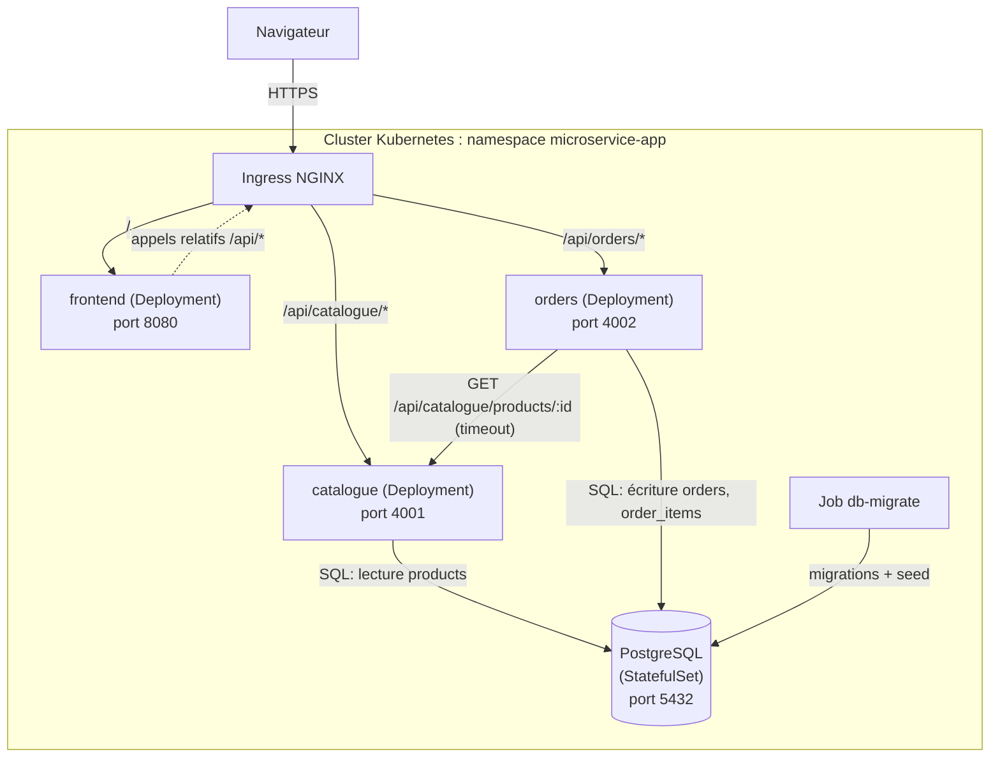
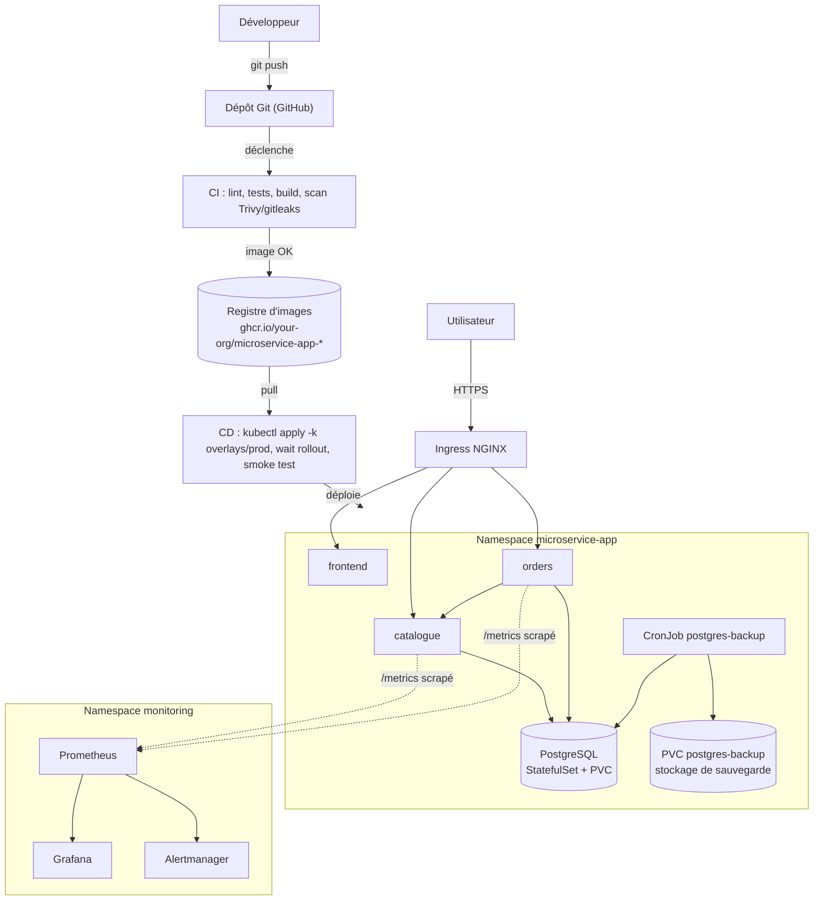

# Architecture

## Vue d'ensemble

microservice-app est une application de démonstration composée de quatre briques déployées dans le
namespace Kubernetes `microservice-app` :

| Composant   | Responsabilité                                           | Techno                                     |
| ----------- | -------------------------------------------------------- | ------------------------------------------ |
| `frontend`  | Interface web : liste des produits, création de commande | React + Vite + TypeScript, servi par NGINX |
| `catalogue` | Lecture et gestion minimale des produits                 | Node.js + TypeScript (Fastify)             |
| `orders`    | Création et consultation des commandes                   | Node.js + TypeScript (Fastify)             |
| `postgres`  | Stockage des produits et des commandes                   | PostgreSQL (StatefulSet)                   |

`catalogue` et `orders` sont deux services indépendants qui partagent la même instance
PostgreSQL mais pas de code d'accès aux données : chaque service possède ses propres requêtes,
son propre pool de connexions et sa propre configuration. `orders` ne lit jamais directement les
tables possédées par `catalogue` : il passe systématiquement par l'API HTTP de `catalogue` pour
valider un produit et récupérer son prix.

## Diagramme



## Schéma global (CI/CD, registre, monitoring, sauvegarde)

Vue complète du cycle de vie, du commit à l'exploitation, avec les composants hors du cluster
applicatif (pipeline, registre d'images) et les à-côtés opérationnels (monitoring, sauvegarde) :



Correspondance avec les manifests : `Ingress` = [`k8s/base/ingress.yaml`](../k8s/base/ingress.yaml),
`frontend`/`catalogue`/`orders`/`postgres` = [`k8s/base/`](../k8s/base/) (mêmes noms de
Deployments/StatefulSet/Services que dans le cluster), `postgres-backup` = CronJob et PVC de
[`k8s/base/backup.yaml`](../k8s/base/backup.yaml) (voir [`docs/backup-restore.md`](./backup-restore.md)),
`monitoring` = stack Helm `kube-prometheus-stack` + [`k8s/observability/`](../k8s/observability/)
(voir [`docs/observability.md`](./observability.md)), pipeline CI/CD = `.github/workflows/ci.yml`
et `.github/workflows/cd.yml` (voir [`docs/ci-cd.md`](./ci-cd.md)).

## Composants et responsabilités

- **frontend** : consomme les APIs via des chemins relatifs (`/api/catalogue/...`,
  `/api/orders/...`), ne contient aucune URL interne au cluster, ne gère pas d'authentification.
- **catalogue** : source de vérité du produit (nom, prix, stock). Expose uniquement de la
  lecture.
- **orders** : source de vérité de la commande. Valide les entrées, interroge `catalogue` pour
  chaque produit référencé, capture le prix au moment de la commande, calcule le total côté
  serveur et persiste la commande de façon transactionnelle.
- **PostgreSQL** : instance unique partagée par les deux services applicatifs, schéma unique
  décrit dans [`docs/data-model.md`](./data-model.md). Les migrations sont appliquées par un job
  dédié, jamais par les replicas applicatifs.

## Flux réseau

1. Navigateur -> Ingress (HTTPS en production, HTTP en démonstration locale).
2. Ingress -> `frontend` pour les routes autres que `/api/*`.
3. Ingress -> `catalogue` pour `/api/catalogue/*`.
4. Ingress -> `orders` pour `/api/orders/*`.
5. `orders` -> `catalogue` (HTTP interne au cluster, `CATALOGUE_BASE_URL`) uniquement lors de la
   création d'une commande, avec timeout explicite.
6. `catalogue` -> PostgreSQL (lecture seule dans le périmètre actuel).
7. `orders` -> PostgreSQL (lecture/écriture transactionnelle).
8. Job `db-migrate` -> PostgreSQL, exécuté hors du cycle de vie des Deployments applicatifs.

## Contrats HTTP initiaux

| Méthode | Route                         | Service           | Description                                                                                                                                                                   |
| ------- | ----------------------------- | ----------------- | ----------------------------------------------------------------------------------------------------------------------------------------------------------------------------- |
| GET     | `/api/catalogue/products`     | catalogue         | Liste des produits                                                                                                                                                            |
| GET     | `/api/catalogue/products/:id` | catalogue         | Détail d'un produit                                                                                                                                                           |
| POST    | `/api/orders`                 | orders            | Création d'une commande                                                                                                                                                       |
| GET     | `/api/orders/:id`             | orders            | Détail d'une commande                                                                                                                                                         |
| GET     | `/health/live`                | catalogue, orders | Liveness, sans dépendance externe                                                                                                                                             |
| GET     | `/health/ready`               | catalogue, orders | Readiness, vérifie PostgreSQL (et rien d'autre pour `orders` : la dépendance à `catalogue` n'est pas testée en readiness pour éviter un couplage de disponibilité en cascade) |
| GET     | `/healthz`                    | frontend          | Fichier statique servi par NGINX                                                                                                                                              |

Les réponses d'erreur des deux API suivent une enveloppe commune :

```json
{ "error": { "code": "VALIDATION_ERROR", "message": "...", "details": {} } }
```

## Ports

| Service   | Port interne | Variable |
| --------- | ------------ | -------- |
| frontend  | 8080         | -        |
| catalogue | 4001         | `PORT`   |
| orders    | 4002         | `PORT`   |
| postgres  | 5432         | -        |

En développement local (hors conteneur), PostgreSQL est exposé sur `5433` sur la machine hôte
(cf. `scripts/dev-db-up.sh`) pour ne pas entrer en conflit avec un éventuel PostgreSQL déjà
présent sur la machine.

## Choix structurants

- **Monorepo pnpm workspaces** (`apps/*`, `services/*`, `packages/*`) : un seul lockfile, mêmes
  versions d'outils partagées, scripts racine (`build`, `test`, `lint`, `dev`) qui délèguent aux
  paquets.
- **TypeScript partout** (frontend et services) pour un typage de bout en bout et parce que les
  deux API partagent des contrats de données.
- **Fastify** pour les deux services Node : logger JSON (pino) intégré nativement, hooks de cycle
  de vie propres pour l'arrêt (`onClose`), faible surcharge. Alternative écartée : Express, qui
  aurait demandé d'assembler manuellement logger + validation + arrêt propre.
- **Zod** pour la validation des entrées : schémas TypeScript-first, messages d'erreur exploitables,
  pas de génération de code.
- **`pg` (node-postgres) sans ORM** : les requêtes sont simples (2 à 3 tables), un ORM aurait
  ajouté une couche d'abstraction sans bénéfice pour ce périmètre, alors qu'un accès SQL direct
  facilite le contrôle explicite des transactions (commande + lignes de commande) et des timeouts.
- **`node-pg-migrate`** pour les migrations (paquet dédié `packages/db`, partagé par les deux
  services mais non exécuté par eux) : migrations versionnées en JS, exécution via un Job
  Kubernetes séparé des Deployments applicatifs.
- **`packages/shared`** : regroupe uniquement le logger JSON commun et un helper `fetch` avec
  timeout, consommés par `catalogue` et `orders`. Le frontend ne dépend pas de ce paquet : ses
  types d'API sont redéfinis localement (quelques lignes dupliquées) pour éviter de faire
  dépendre le bundler Vite de la résolution d'un paquet workspace TypeScript non compilé.
- **Vitest** comme unique framework de test (frontend et services), pour limiter le nombre
  d'outils différents dans le monorepo.
- **Manifests Kubernetes bruts + Kustomize** (`k8s/base` + `k8s/overlays`) plutôt que Helm : le
  périmètre (3 services + Postgres) ne justifie pas un chart paramétrable, Kustomize suffit à
  distinguer les overlays (dev/prod) tout en gardant des manifests lisibles.
- **Versionnement des images** : tag = SHA court du commit Git (`git rev-parse --short HEAD`)
  pour tout déploiement ; un tag sémantique additionnel (`vX.Y.Z`) est ajouté uniquement lors
  d'une release explicite. `latest` n'est jamais utilisé dans un manifest.

## Limites initiales

- Aucune authentification ni autorisation (hors périmètre du projet).
- `orders` ne gère pas l'annulation ni la mise à jour de stock du produit après commande (pas de
  décrément de `stock`).
- Pas de pagination sur `GET /api/catalogue/products` au-delà d'une limite fixe raisonnable
  : suffisant pour un jeu de données de démonstration.
- Le couplage `orders -> catalogue` est synchrone (HTTP avec timeout), pas de file de messages :
  choix assumé pour rester simple et démontrable.
