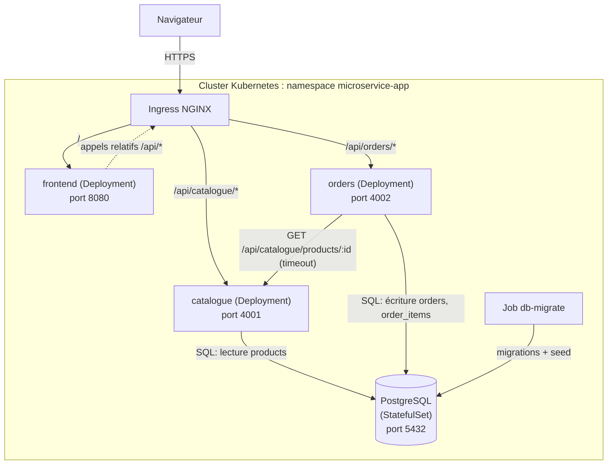

# Architecture

## Vue d'ensemble

microservice-app est composée de quatre briques, déployées dans le namespace Kubernetes
`microservice-app` :

| Composant   | Rôle                                                     | Techno                                     |
| ----------- | -------------------------------------------------------- | ------------------------------------------ |
| `frontend`  | Interface web : liste des produits, création de commande | React + Vite + TypeScript, servi par NGINX |
| `catalogue` | Lecture et gestion minimale des produits                 | Node.js + TypeScript (Fastify)             |
| `orders`    | Création et consultation des commandes                   | Node.js + TypeScript (Fastify)             |
| `postgres`  | Stockage des produits et des commandes                   | PostgreSQL (StatefulSet)                   |

`catalogue` et `orders` partagent la même instance PostgreSQL mais pas de code d'accès aux
données : chacun a ses propres requêtes, son propre pool de connexions et sa propre config.
`orders` ne touche jamais aux tables de `catalogue` directement - il passe par son API HTTP pour
valider un produit et récupérer son prix.

## Diagramme



## Vue d'ensemble du cycle de vie

Le diagramme ci-dessus montre le cluster applicatif ; celui-ci ajoute la CI/CD, le registre
d'images et les à-côtés opérationnels (monitoring, sauvegarde) :


Pour retrouver les manifests correspondants : `Ingress` = [`k8s/base/ingress.yaml`](../k8s/base/ingress.yaml),
les Deployments/StatefulSet/Services applicatifs = [`k8s/base/`](../k8s/base/),
`postgres-backup` = [`k8s/base/backup.yaml`](../k8s/base/backup.yaml) (détails dans
[`docs/backup-restore.md`](./backup-restore.md)), monitoring = stack Helm +
[`k8s/observability/`](../k8s/observability/) (détails dans [`docs/observability.md`](./observability.md)),
CI/CD = `.github/workflows/` (détails dans [`docs/ci-cd.md`](./ci-cd.md)).

## Composants et responsabilités

- **frontend** : consomme les API via des chemins relatifs (`/api/catalogue/...`,
  `/api/orders/...`), ne connaît aucune URL interne au cluster, ne gère pas d'authentification.
- **catalogue** : source de vérité du produit (nom, prix, stock). N'expose que de la lecture.
- **orders** : source de vérité de la commande. Valide les entrées, interroge `catalogue` pour
  chaque produit référencé, capture le prix au moment de la commande, calcule le total côté
  serveur et persiste tout ça de façon transactionnelle.
- **PostgreSQL** : une instance unique partagée par les deux services, schéma décrit dans
  [`docs/data-model.md`](./data-model.md). Les migrations passent par un job dédié, jamais par
  les replicas applicatifs.

## Flux réseau

1. Navigateur -> Ingress (HTTPS en prod, HTTP en démo locale).
2. Ingress -> `frontend` pour tout ce qui n'est pas `/api/*`.
3. Ingress -> `catalogue` pour `/api/catalogue/*`, -> `orders` pour `/api/orders/*`.
4. `orders` -> `catalogue` (HTTP interne, `CATALOGUE_BASE_URL`) uniquement à la création d'une
   commande, avec timeout explicite.
5. `catalogue` -> PostgreSQL (lecture seule pour l'instant).
6. `orders` -> PostgreSQL (lecture/écriture transactionnelle).
7. Job `db-migrate` -> PostgreSQL, exécuté à part du cycle de vie des Deployments.

## Contrats HTTP

| Méthode | Route                         | Service           | Description                                                                                                |
| ------- | ----------------------------- | ----------------- | ---------------------------------------------------------------------------------------------------------- |
| GET     | `/api/catalogue/products`     | catalogue         | Liste des produits                                                                                         |
| GET     | `/api/catalogue/products/:id` | catalogue         | Détail d'un produit                                                                                        |
| POST    | `/api/orders`                 | orders            | Création d'une commande                                                                                    |
| GET     | `/api/orders/:id`             | orders            | Détail d'une commande                                                                                      |
| GET     | `/health/live`                | catalogue, orders | Liveness, sans dépendance externe                                                                          |
| GET     | `/health/ready`               | catalogue, orders | Readiness, vérifie PostgreSQL (pour `orders`, ne vérifie pas `catalogue` - sinon une panne se propagerait) |
| GET     | `/healthz`                    | frontend          | Fichier statique servi par NGINX                                                                           |

Les erreurs des deux API suivent la même enveloppe :

```json
{ "error": { "code": "VALIDATION_ERROR", "message": "...", "details": {} } }
```

## Ports

| Service   | Port interne | Variable |
| --------- | ------------ | -------- |
| frontend  | 8080         | -        |
| catalogue | 4001         | `PORT`   |
| orders    | 4002         | `PORT`   |
| postgres  | 5432         | -        |

En local (hors conteneur), PostgreSQL est exposé sur `5433` côté hôte (voir
`scripts/dev-db-up.sh`) pour ne pas entrer en conflit avec un éventuel PostgreSQL déjà installé.

## Quelques choix qu'on a faits

- **Monorepo pnpm workspaces** (`apps/*`, `services/*`, `packages/*`) : un seul lockfile, mêmes
  versions d'outils partout, scripts racine qui délèguent aux paquets.
- **TypeScript partout** pour un typage de bout en bout, les deux API partageant des contrats de
  données.
- **Fastify** plutôt qu'Express : logger JSON (pino) intégré, hooks d'arrêt propre natifs, faible
  surcharge - Express aurait demandé d'assembler tout ça à la main.
- **Zod** pour valider les entrées : schémas TypeScript-first, messages d'erreur exploitables.
- **`pg` sans ORM** : les requêtes restent simples (2-3 tables), un ORM aurait ajouté une couche
  d'abstraction sans vraie plus-value ici, alors que le SQL direct facilite le contrôle des
  transactions et des timeouts.
- **`node-pg-migrate`** pour les migrations, exécutées via un Job Kubernetes séparé des
  Deployments applicatifs plutôt qu'au démarrage de chaque replica.
- **`packages/shared`** regroupe juste le logger JSON commun et un helper `fetch` avec timeout. Le
  frontend n'en dépend pas : ses types d'API sont redéfinis localement (quelques lignes dupliquées)
  pour ne pas faire dépendre Vite d'un paquet workspace TypeScript non compilé.
- **Vitest** partout, pour limiter le nombre d'outils différents dans le monorepo.
- **Manifests Kubernetes bruts + Kustomize** plutôt que Helm : pour 3 services + Postgres, un
  chart paramétrable n'apporte pas grand-chose, Kustomize suffit à distinguer dev/prod tout en
  gardant des manifests lisibles.
- **Tag d'image = SHA court du commit**, jamais `latest`. Un tag sémantique (`vX.Y.Z`) s'ajoute en
  plus lors d'une release.

## Limites connues

- Aucune authentification ni autorisation (hors périmètre du projet).
- Pas d'annulation de commande ni de décrément de stock après achat.
- Pas de pagination sur `GET /api/catalogue/products` au-delà d'une limite fixe - largement
  suffisant pour un jeu de données de démo.
- `orders -> catalogue` est synchrone (HTTP + timeout), pas de file de messages : un choix assumé
  pour rester simple et démontrable.
